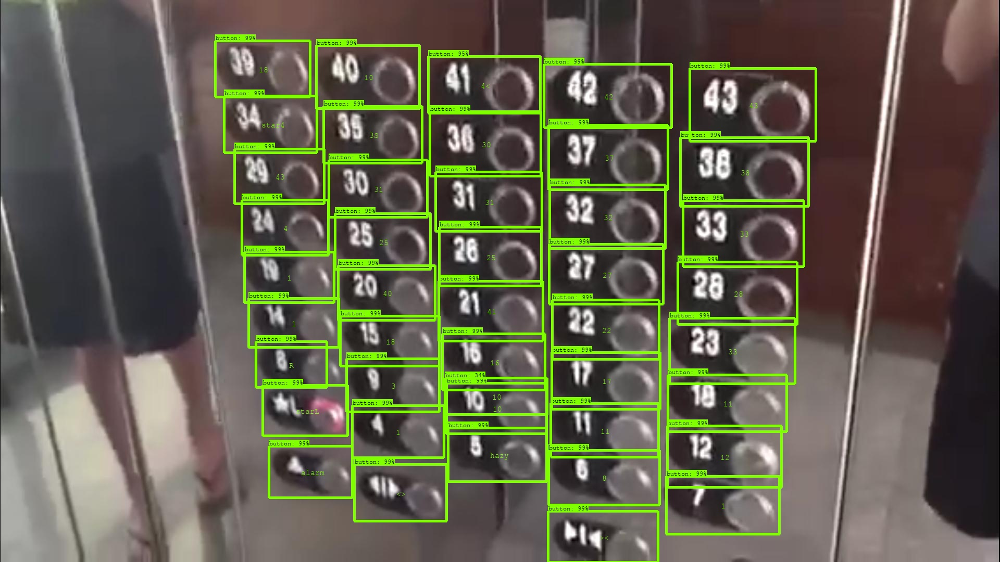
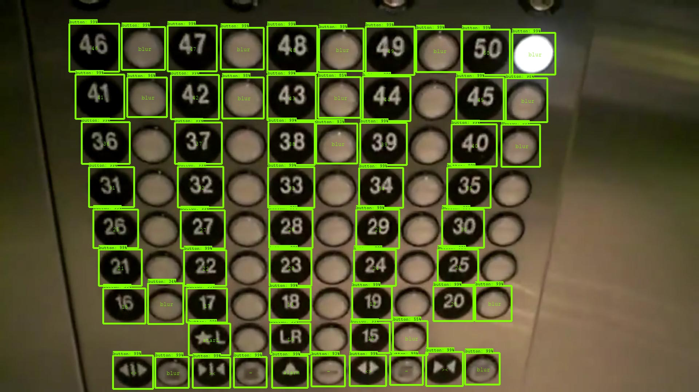

# A Novel OCR-RCNN for Elevator Button Recognition

by [Delong Zhu](http://www.ee.cuhk.edu.hk/~dlzhu/) at Robotics, Perception, and AI Laboratory, CUHK

# A more efficient and accurate model, [Cascaded OCR-RCNN](https://github.com/zhudelong/ocr-rcnn-v2), as well as the [BUTTON DATASET](https://mycuhk-my.sharepoint.com/:u:/g/personal/1155067732_link_cuhk_edu_hk/EXk9Wqtilt9OlwlnpUtzJ50BmDu6vObE-ZjW2H6iVgUiZQ?e=0QJAyB), is available now, A ``dataset_statistics.py`` in the utils folder is also provided for dataset manipulation.

### Introduction

**OCR-RCNN** is designed for elevator button recognition task based on [Faster RCNN](http://arxiv.org/abs/1506.01497), which includes a Region Proposal Network (RPN), an Object Detection Network and a Character Recognition Network. This framework aims to help solve inter-floor navigation problem of service robots.

In this package, a **button recognition service** is implemented based on a trained OCR-RCNN model. The service takes a raw image as input and returns the detection, localization and character recognition results. Besides, a **Multi-Tracker** is also implemented, which utilizes the outputs of recognition service to initialize the tracking process, yielding an on-line detection performance.

If you find it helpful to your project, please consider cite our paper:

```
@inproceedings{zhu2018novel,
  title={A Novel OCR-RCNN for Elevator Button Recognition},
  author={Zhu, Delong and Li, Tingguang and Ho, Danny and Zhou, Tong and Meng, Max QH},
  booktitle={2018 IEEE/RSJ International Conference on Intelligent Robots and Systems (IROS)},
  pages={3626--3631},
  year={2018},
  organization={IEEE}
}
@ARTICLE{9324975,
  author={D. {Zhu} and Y. {Fang} and Z. {Min} and D. {Ho} and M. Q. . -H. {Meng}},
  journal={IEEE Transactions on Industrial Electronics}, 
  title={OCR-RCNN: An Accurate and Efficient Framework for Elevator Button Recognition}, 
  year={2021},
  volume={},
  number={},
  pages={1-1},
  doi={10.1109/TIE.2021.3050357}}
```


### Contents
0. [Requirements](#requirements)
0. [Preparation](#Preparation)
0. [Demonstration](#Demonstration)

### Requirements

1. Ubuntu 14.04
2. ROS indigo
2. TensorFlow 1.4.1
0.	OpenCV 3.4.1
     - compiled with OpenCV's [extra modules](https://github.com/opencv/opencv_contrib)
2.	GPU: GTX Titan X
	- with a total memory of 12288MB

### Preparation:
0.	Download the [OCR-RCNN model](https://drive.google.com/file/d/1SM3p5NW6k2R04Bn72T1veE8hJSNnbvzf/view?usp=sharing) and put it in the folder `elevator_button_recognition/src/button_recognition/ocr_rcnn_model/`
0.	Run `cd elevator_button_recognition` and run `catkin_init_workspace`
0.	Run `catkin_make -j[thread_number]`
1.	Run `source elevator_button_recognition/devel/setup.bash` or add the command to '~/.bashrc'
2.	(Optional) add the path of ocr-rcnn mode to launch file at `elevator_button_recognition/src/button_recognition/launch`
3.	(Optional) add the path of test samples to launch file at `elevator_button_recognition/src/button_tracker/launch`
   - If `image_only == true`, three panel images in `src/button_tracker/test_samples` will be tested.
   - If `image_only == false`, a video in `src/button_tracker/test_samples` will be tested.

### Demonstration:
1.	Run `roslaunch button_recognition button_recognition.launch ` to launch the recognition service, which recieves a `sensor_msgs/CompressedImage` as input and return a `recog_result` (self-defined) type of response.
2.	Run `roslaunch button_tracker button_tracker.launch` to launch the tracking node, where the recognition service is called to initialize a 'Multi-Tracker`.
   - The simplest KCF tracker is used in this implementation.
   - Change the multi-tracker to single-tracker will further increase the processing speed.
3.	Two demo-images are listed as follows. They are screenshots from two Youtube videos. Recognition results are visualized at the center of each bounding box.

  <p align="center">
    
    Image Source: [https://www.youtube.com/watch?v=bQpEYpg1kLg&t=8s]
  </p>
  <p align="center">
    
    Image Source: [https://www.youtube.com/watch?v=k1bTibYQjTo&t=9s]
  </p>

4. Two demo-videos are also provided. The [first one](https://www.youtube.com/watch?v=2iRoNHpzLl0) is a composition video, where each frame is processed off-line, then composed to a complete video. This video shows us the recognition performance of OCR-RCNN in an untrained elevator. The [second one](https://www.youtube.com/watch?v=fR4KnNOLeNs) is a real-time video, where the OCR-RCNN and a `Multi-Tracker` is utilized to carry out on-line recognition task. As we can see, although the tracker can help increase the recognition speed, its accuracy and robustness are worse than the off-line version. So, it is crucial to further improve the OCR-RCNN's time efficiency in the next stage!

  <p align="center">
  <a href="https://www.youtube.com/watch?v=2iRoNHpzLl0" target="Processed by OCR-RCNN off-line"></a>
  Processed by OCR-RCNN off-line
  </p>
  <p align="center">
  <a href="https://www.youtube.com/watch?v=fR4KnNOLeNs" target="Processed by OCR-RCNN and KCF tracker on-line"></a>
  Processed by OCR-RCNN and KCF tracker on-line.
  </p>
